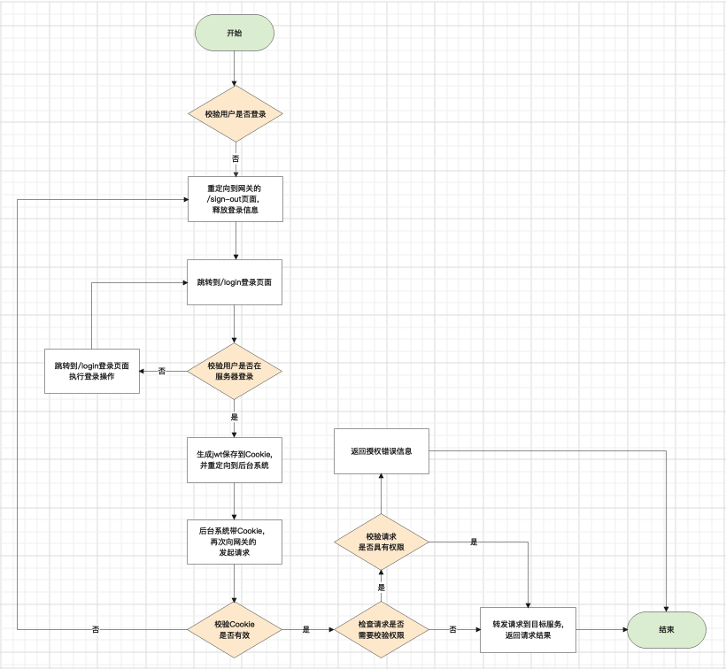

# sso
基于rbac的单点系统

这是一套纯粹的后台单点管理系统，用于解决1个或多个后台管理系统的账号登录和授权管理。默认使用前后端分离技术。服务端使用golang开发，基于go-zero框架；前端使用vue3开发，基于ant design vue。

sso具有auth、ssoms、和gateway三个系统，分别具有以下功能：
```yaml
auth: 负责系统登录验证、页面权限验证、接口授权验证
ssoms: 负责角色、用户管理、系统和菜单管理、角色授权
gateway: 登录登出页面、负责接入请求和转发请求
```

Ginv SSO的多个后台系统需是在同一个域名下的子域名。这样做的目的是使用安全的httpOnly的Cookie在多个系统之间进行用户身份识别。

### 特色

1. 根据go-zero的goctl创建的api规则, 将请求按resetful风格进行权限校验
2. 前端可以通过goctl的api文件生成ts，请求gateway，提高前端工作效率
3. 菜单&操作使用uuid作为唯一键，而不是自增id，方便不同环境或系统克隆菜单
4. 菜单&操作高亮展示搜索结果
5. 批量导入结果返回多种状态和导入信息，忽略重复记录

### 关于ssoms

ssoms是单点登录的管理后台，它具有以下功能

**用户管理：** 用户基本信息的增删改，角色分配

**角色管理：** 角色基本操作，分配用户，角色的菜单&操作权限分配

**系统管理：** 管理使用单点登录的后台系统

**菜单管理：** 配置系统的菜单&操作，支持高亮查询，批量导入、导出

**个人中心：** 修改登录用户自己的头像、密码、个人说明等


### 关于前端请求
前端请求的入口，接收的请求headers必须具有如下信息：

| key | 说明 |
|:--|:--|
| cookie | 登录的后生成的cookie, 由gateway的登录后的跳转页面提供，用于登录校验、授权 |
| Refere | 告诉服务端由哪个页面发起的请求，这边使用unsafe-url配置，用于日志、授权白名单等 |
| x-client-env | 环境，可选值有test\|online\|gray，用于日志、不同环境处理等 |
| x-client-service | 请求的服务端的服务名，用于转发请求 |
| x-client-system | 后台系统的系统名，用于授权查询 |
| x-client-uri | 请求服务端的操作，用于授权查询 |


### 关于gateway：
gateway主要负责转发功能，为了保证生成Cookie由服务端下发的页面创建，网关还提供了登录、登出和登录跳转页(跳转到相应的系统)。

gateway通过请求的headers[x-client-service], 知道转发给哪个服务，在转发请求之前，会请求auth服务，根据cookie, 会解析到用户的信息，根据x-client-system和x-client-uri
以及发起请求的Method则可以验证是否具有权限。如果验证通过，auth服务会返回用户的uuid和name，并追加到headers[x-origin-uuid]参数和headers[x-origin-name]参数。

### 关于其他接入单点的系统
先登录ssoms，通过`系统管理`创建系统，并在`菜单&操作`创建相应的页面及操作，最后给用户相应的角色进行授权。

其他系统会全局接受headers[x-origin-uuid]和headers[x-origin-name]放入context中，在loginc函数中就可以直接拿取用户的uuid和name：
```go
uuid := l.ctx.Value(config.UUID).(string)
name := l.ctx.Value(config.Name).(string)
```

### 流程图




## 部署说明

1. 导入`backup.sql`,并执行下面的sql修改单点管理后台的域名:
```sql
-- identifier的值设置为单点管理后台的域名, 这边以http://ssoms.ginv.com为例
UPDATE object SET identifier='http://ssoms.ginv.com' WHERE uuid='kreppg8md1sb'
```

2. 相关服务后台运行和编译
```bash
# auth
cd service/auth/api
go run auth.go
# 默认加载etc/auth.yaml配置文件，通过-f参数使用不同的配置文件，例如go run auth.go -f etc/auth.dev.yaml

# 编译生成可执行文件: go build auth.go


# ssoms
cd service/ssoms/api
go run ssoms.go
# 默认加载etc/ssoms.yaml配置文件，通过-f参数使用不同的配置文件，例如go run ssoms.go -f etc/ssoms.dev.yaml

# 编译生成可执行文件: go build ssoms.go

# ssoms vue后台
cd service/ssoms/vue
yarn install
yarn dev
# 打包前端代码: yarn build

# gateway
cd service/gateway/api
go run auth.go
# 默认加载etc/gateway.yaml配置文件，通过-f参数使用不同的配置文件，例如go run gateway.go -f etc/gateway.dev.yaml

# 编译生成可执行文件: go build gateway.go
```


 
 

